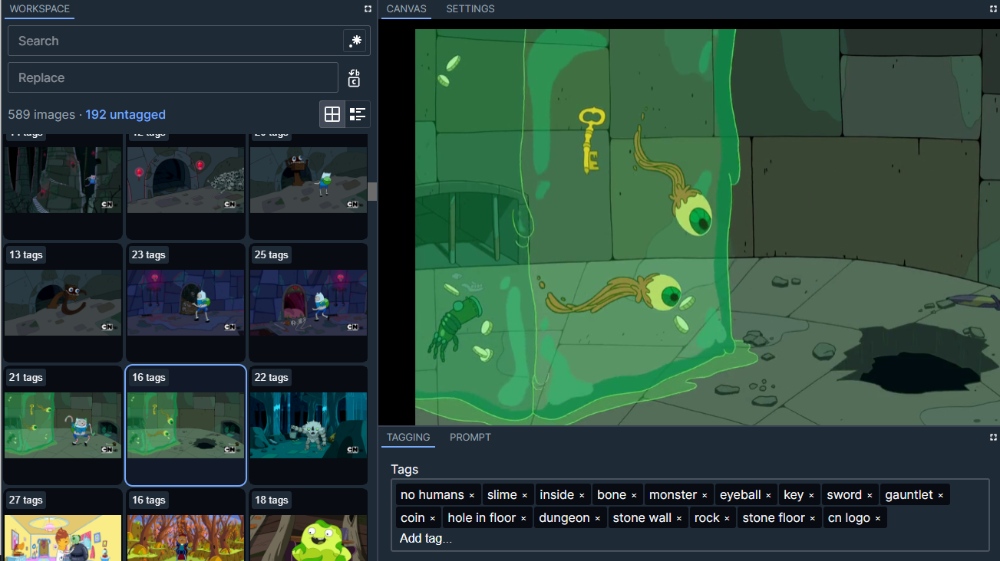

# Stable Diffusion Labeler

Tooling to optimize my own workflow when training Stable Diffusion models and LoRA.

This is an Electron app built with Material UI and designed to integrate with Auto1111's Stable Diffusion API and Kohya scripts for LoRA/LyCORIS training.

Inspired by tools like [BooruDatasetTagManager](https://github.com/starik222/BooruDatasetTagManager) and VSCode.



## ⚠ Work in Progress ⚠

This repo is in active development as I add more features to support my workflow for dataset management, controlnet sketching, etc.

You can take a look at my Figma sketch for an idea of what direction this is headed: [SD Labeler on Figma](https://www.figma.com/file/mBfIF1P9wFC8kjBMZJ6HX6/SD-Labeler?type=design&node-id=0%3A1&mode=design&t=VtsHXogDSxcLOzrO-1)

## Installation

Clone the repo and do a `yarn install`

## Starting Development

`yarn start` to spin up a dev server. This is built off of [Electron React Boilerplate](https://electron-react-boilerplate.js.org/) so you get all the fun stuff like hot reload and asset packing.

Icons are driven by [Iconify](https://icon-sets.iconify.design/).

## Packaging for Production

```yarn package``` is all you'll need.
